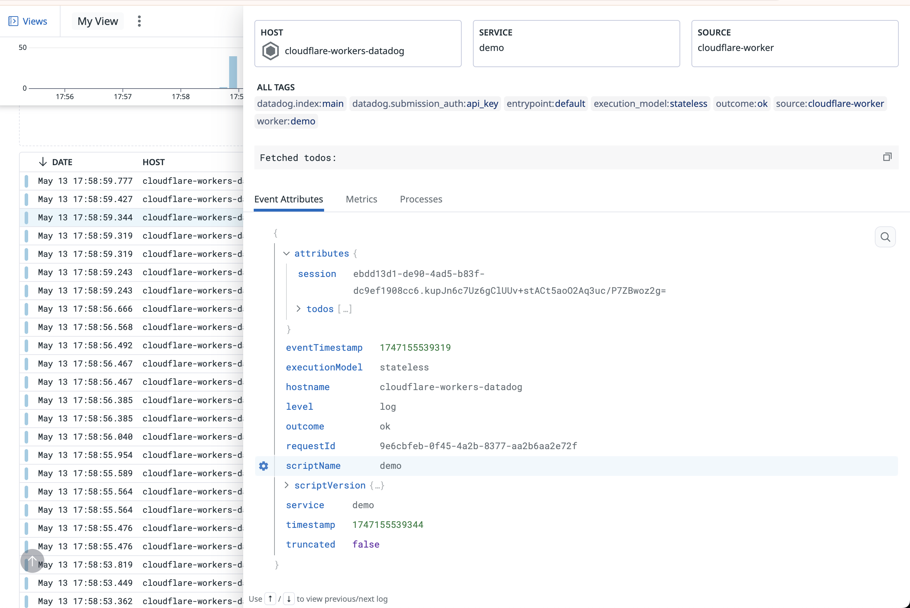

# Cloudflare Workers Datadog Demo

This project demonstrates how to integrate Cloudflare Workers with Datadog for comprehensive observability. It showcases how to send metrics, logs, and traces from your Cloudflare Workers to Datadog, providing you with real-time insights into your application's performance and behavior.



## Project Overview

The demo consists of two Cloudflare Workers:

1. **Demo Worker** (`workers/demo`): A simple TODO application that demonstrates:
   - Sending custom metrics to Datadog
   - Distributed tracing with OpenTelemetry - WIP: I suspect this is blocked by lack of access to [agentless otlp intake endpoint](https://docs.datadoghq.com/opentelemetry/setup/agentless/)
   - Integrating with D1 database for data storage

2. **Datadog Tail Worker** (`workers/datadog-tail`): A worker that:
   - Receives logs from the Demo worker via [Cloudflare's Tail Workers](https://developers.cloudflare.com/workers/observability/logs/tail-workers/)
   - Formats and forwards the data to Datadog's Logs API
   - Adds appropriate metadata and tags for better organization in Datadog

## Features

- **Custom Metrics**: Track user sessions, application usage, and performance metrics
- ~~**Distributed Tracing**~~: Monitor request flows and identify bottlenecks
- **Logs Forwarding**: Centralize logs from all workers in Datadog

## Getting Started

### Prerequisites

- [Node.js](https://nodejs.org/) (v22.15.0 or later)
- [pnpm](https://pnpm.io/) (v8.15.4 or later)
- [Wrangler CLI](https://developers.cloudflare.com/workers/wrangler/install-and-update/) (v4.14.4 or later)
- A Cloudflare account with Workers and D1 enabled
- A Datadog account with API key

### Installation

1. Clone the repository
2. Install dependencies:

```bash
pnpm install
```

## Deployment

### 1. Deploy the Datadog Tail Worker

First, you need to deploy the Datadog Tail worker that will forward logs to Datadog:

1. Navigate to the datadog-tail directory:

```bash
cd workers/datadog-tail
```

2. Configure your Datadog API key as a secret:

```bash
npx wrangler secret put DATADOG_API_KEY
```

3. Deploy the worker:

```bash
npx wrangler deploy
```

### 2. Deploy the Demo Worker

Next, deploy the demo application worker:

1. Navigate to the demo directory:

```bash
cd workers/demo
```

2. Initialize the D1 database:

```bash
npx wrangler d1 execute demo_db --file=migrations/0001_initialise-database.sql
```

3. Configure your Datadog API key as a secret:

```bash
npx wrangler secret put DATADOG_API_KEY
```

4. Deploy the worker:

```bash
npx wrangler deploy
```

## Configuring Datadog Integration

### Setting Up Your Datadog API Key

Both workers require a Datadog API key to send data to your Datadog account:

1. In your [Datadog account](https://app.datadoghq.com/), navigate to **Organization Settings** → **API Keys**
2. Create a new API key or copy an existing one
3. Add the API key to both workers:

```bash
cd workers/datadog-tail
npx wrangler secret put DATADOG_API_KEY
# Enter your Datadog API key when prompted

cd ../demo
npx wrangler secret put DATADOG_API_KEY
# Enter your Datadog API key when prompted
```

### Customizing Datadog Settings

The default configuration uses Datadog's US3 region endpoint. If you need to use a different region:

1. Edit the following files to update the Datadog URLs:
   - `workers/datadog-tail/wrangler.jsonc`: Update the `DATADOG_URL` variable
   - `workers/demo/src/index.ts`: Update the `apiUrl` in the metrics configuration and the OpenTelemetry exporter URL

## Viewing Data in Datadog

After deploying both workers and making requests to the demo application:

1. **Logs**: View your logs in the [Datadog Logs Explorer](https://app.datadoghq.com/logs)
   - Filter by `source:cloudflare-worker` to see only Cloudflare Workers logs
   - Use tags like `worker:demo` to filter by specific workers

2. **Metrics**: View metrics in the [Datadog Metrics Explorer](https://app.datadoghq.com/metric/explorer)
   - Custom metrics from the application will have your service name as a prefix

3. **Traces**: View distributed traces in the [Datadog APM](https://app.datadoghq.com/apm/traces)
   - Filter by service name to see traces specific to your workers

## How it Works

### Metrics Flow

1. The Demo worker collects metrics using a custom Metrics class (`workers/demo/src/metrics.ts`)
2. Metrics are tracked per request context using AsyncLocalStorage
3. At the end of each request, metrics are flushed and sent to Datadog's Metrics API

### Logs and Traces Flow

1. The Demo worker logs using the standard js console.log api
2. The Datadog Tail worker receives these logs because of the Tail Consumers configuration
3. The Tail worker formats the data according to Datadog's API requirements and adds relevant tags
4. Formatted data is sent to Datadog's Logs API

## Additional Resources

- [Cloudflare Workers Documentation](https://developers.cloudflare.com/workers/)
- [Datadog API Documentation](https://docs.datadoghq.com/api/)
- [OpenTelemetry Documentation](https://opentelemetry.io/docs/)
